# ML System Design Doc - [RU]
## Дизайн ML системы - California Housing Price Prediction

## 1. Цели и предпосылки

### 1.1. Зачем идем в разработку продукта?

- **Бизнес-цель (Product Owner):** Добавить на сайт по купле/продаже недвижимости новую функцию — «Онлайн-оценка стоимости дома». Это позволит потенциальным продавцам быстро получить примерную рыночную стоимость своего объекта без необходимости обращения к специалисту.
- **Почему станет лучше, чем сейчас, от использования ML (Product Owner & Data Scientist):** В текущем процессе оценка выполняется специалистами вручную, что занимает значительное время (от нескольких часов до дней) и требует вовлечения персонала. Внедрение ML-модели позволит:
    - Автоматизировать процесс и сделать его мгновенным (до 1 секунды).
    - Снизить нагрузку на специалистов, оставив за ними только сложные или нестандартные объекты.
    - Повысить лояльность пользователей за счет полезного бесплатного инструмента.
- **Что будем считать успехом итерации с точки зрения бизнеса (Product Owner):** Успехом итерации является создание работающего прототипа сервиса, способного выдавать предсказания с приемлемой точностью. Метрика успеха: **Медианная абсолютная ошибка (MAE) модели не превышает 0.5 (в логарифмированном масштабе цен), что примерно соответствует отклонению в 15-20% от реальной цены для большинства объектов**. Прототип должен быть готов к демонстрации стейкхолдерам.

### 1.2. Бизнес-требования и ограничения

- **Краткое описание БТ (Product Owner):**
    -  Сервис должен принимать на вход основные характеристики объекта недвижимости (доход населения, возраст жилья, количество комнат, население, координаты и т.д.).
    -  Сервис должен возвращать предсказанную медианную стоимость дома в формате JSON.
    -  Взаимодействие с сервисом должно осуществляться по HTTP (REST API).
- **Бизнес-ограничения (Product Owner):**
    - **Срок:** Решение должно быть разработано за 2 дня (до 06.03.2025).
    - **Технологии:** Использовать только open-source библиотеки и инструменты (Python, scikit-learn, FastAPI и т.д.).
    - **Инфраструктура:** Решение должно быть легковесным и запускаться на локальной машине или минимальном облачном сервере (без требований к высоким нагрузкам).
- **Что мы ожидаем от конкретной итерации (Product Owner):** Получить MVP (Minimum Viable Product), который включает в себя исследовательский анализ данных, обученную модель и API-сервис для взаимодействия с ней.
- **Описание бизнес-процесса пилота (Product Owner):** На этапе пилота процесс выглядит следующим образом:
    1.  Пользователь на сайте заполняет форму с характеристиками своего дома.
    2.  Эти данные отправляются на наш ML-сервис (API).
    3.  Сервис возвращает предсказанную стоимость.
    4.  Предсказание отображается пользователю на сайте.
- **Что считаем успешным пилотом? Критерии успеха и возможные пути развития проекта (Product Owner):**
    - **Успех пилота:** Демонстрация стабильной работы API на тестовых запросах и достижение целевой метрики качества (MAE ≤ 0.5) на отложенной тестовой выборке.
    - **Пути развития:**
        1.  Сбор обратной связи от пользователей и специалистов.
        2.  Расширение набора признаков (например, добавление данных о районе, этаже, материале стен).
        3.  Улучшение модели (переход на более сложные алгоритмы, ансамбли).
        4.  Разработка простого веб-интерфейса (фронтенда) для демонстрации.
        5.  Внедрение системы мониторинга качества предсказаний.

### 1.3. Что входит в скоуп проекта/итерации, что не входит

- **На закрытие каких БТ подписываемся в данной итерации (Data Scientist):**
    - Проведение исследовательского анализа данных (EDA) датасета California Housing.
    - Реализация baseline-модели (линейная регрессия).
    - Реализация основной модели (градиентный бустинг, например, XGBoost/LightGBM).
    - Создание API-сервиса на FastAPI с эндпоинтом для предсказаний.
    - Подготовка репозитория с кодом, инструкциями и сохраненными моделями.
- **Что не будет закрыто (Data Scientist):**
    - Интеграция с реальной CRM или базой данных сайта.
    - Разработка полноценного пользовательского интерфейса (фронтенда).
    - Обеспечение отказоустойчивости и обработка высоких нагрузок (тысячи запросов в секунду).
    - Написание тестов (unit, integration) для кода.
- **Описание результата с точки зрения качества кода и воспроизводимости решения (Data Scientist):**
    - Публичный или приватный репозиторий на GitHub.
    - Jupyter ноутбук с EDA, визуализациями и выводами.
    - Python-скрипты для обучения моделей (или второй ноутбук).
    - Сохраненные модели в формате `.pkl` или `.joblib`.
    - Файл `requirements.txt` со всеми зависимостями.
    - Файл `README.md` с четкими инструкциями по установке и запуску сервиса.
    - Код API-сервиса, готовый к локальному запуску.
- **Планируемый технический долг (что оставляем для дальнейшей продуктивизации) (Data Scientist):**
    - Мониторинг дрейфа данных и качества модели в реальном времени.
    - Автоматическое переобучение модели на новых данных (ML pipeline).
    - Логирование запросов и предсказаний.
    - Более глубокая оптимизация гиперпараметров.
    - Контейнеризация (Docker) для упрощения деплоя.

### 1.4. Предпосылки решения

- **Описание всех общих предпосылок решения (Data Scientist):**
    - **Данные:** Используется открытый датасет **California Housing**. Данные содержат информацию по блокам кварталов (block groups) Калифорнии на основе переписи 1990 года. Это стандартный и хорошо изученный набор данных для задач регрессии.
    - **Гранулярность модели:** Уровень прогноза — квартал (блок). Модель предсказывает медианную стоимость дома в данном квартале.
    - **Горизонт прогноза:** Прогноз на текущий момент (исторические данные используются для обучения, модель оценивает стоимость на момент сбора данных). Временной ряд не строится.
    - **Признаки:** Используются все 8 числовых признаков, предоставленных в датасете (`MedInc`, `HouseAge`, `AveRooms`, `AveBedrms`, `Population`, `AveOccup`, `Latitude`, `Longitude`). На этапе EDA будет принято решение о необходимости создания новых признаков (feature engineering).
    - **Целевая переменная:** `MedHouseVal` (медианная стоимость дома в сотнях тысяч долларов). В датасете целевая переменная уже была подвергнута логарифмированию (каппингу) для ограничения выбросов, что является преимуществом.

**2. Методология Data Scientist**

### 2.1. Постановка задачи

С технической точки зрения решается задача **регрессии** (обучение с учителем). Имеется набор исторических данных о квартирах (блоках кварталов) в Калифорнии, каждый объект описывается 8 числовыми признаками. Целевая переменная — медианная стоимость дома (`MedHouseVal`) в сотнях тысяч долларов.

Необходимо построить модель, которая по признакам объекта сможет максимально точно предсказать его стоимость. Модель будет использоваться в онлайн-режиме: пользователь отправляет характеристики объекта через API, сервис возвращает предсказание.

Задача включает в себя:
- проведение разведочного анализа данных (EDA) для понимания распределений, корреляций, наличия выбросов и пропусков;
- предобработку данных (стандартизация числовых признаков, возможно создание новых признаков);
- обучение baseline-модели (линейная регрессия);
- обучение основной модели (градиентный бустинг) с подбором гиперпараметров;
- оценку качества моделей на отложенной тестовой выборке с помощью метрик MAE, RMSE, R²;
- разработку REST API сервиса для инференса;
- демонстрацию работоспособности решения.

### 2.2. Блок-схема решения

Блок-схема отражает ключевые этапы разработки и внедрения модели. Baseline и основная модель имеют одинаковые начальные этапы (EDA, предобработка, разделение данных), различаются только алгоритмами обучения и настройкой гиперпараметров. Поэтому на схеме эти два пути объединены с помощью условного ветвления.  

```mermaid
flowchart TD

    %% --- START ---
    A([Начало])

    %% --- DATA LOADING ---
    B["Загрузка данных<br/>California Housing"]
    
    %% --- EDA ---
    C["EDA и предобработка"]
    C1["Анализ пропусков"]
    C2["Визуализация распределений<br/>(hist, boxplot)"]
    C3["Корреляционный анализ"]
    C4["Обработка выбросов"]
    C5["Feature Engineering"]
    C6["Стандартизация"]

    %% --- SPLIT ---
    D["Разделение данных<br/>Train / Val / Test<br/>60 / 20 / 20"]

    %% --- MODEL TRAINING ---
    E{"Выбор модели"}

    %% --- BASELINE ---
    F["Baseline<br/>Linear Regression"]
    F1["Обучение на Train"]
    F2["Оценка на Val"]

    %% --- BOOSTING ---
    G["Gradient Boosting<br/>XGBoost / LightGBM"]
    G1["Гиперпараметрический поиск<br/>CV (Grid/Random Search)"]
    G2["Обучение финальной модели"]
    G3["Оценка на Val"]

    %% --- COMPARISON ---
    H["Сравнение моделей<br/>MAE / RMSE / R²<br/>на Test"]

    %% --- SELECTION ---
    I{"Выбор лучшей модели"}
    J["Сохранение модели<br/>pickle / joblib"]
    K["Сохранение scaler"]

    %% --- API ---
    L["Разработка API<br/>FastAPI"]
    L1["/predict (POST)"]
    L2["Загрузка модели при старте"]
    L3["Предобработка входных данных"]
    L4["Возврат JSON предсказания"]

    %% --- TESTING ---
    M["Локальный запуск"]
    M1["Тестирование<br/>curl / Postman"]

    %% --- END ---
    N([Конец])

    %% --- FLOW ---
    A --> B --> C
    C --> C1 --> C2 --> C3 --> C4 --> C5 --> C6
    C6 --> D --> E

    E --> F
    F --> F1 --> F2 --> H

    E --> G
    G --> G1 --> G2 --> G3 --> H

    H --> I
    I --> J --> K --> L
    L --> L1 --> L2 --> L3 --> L4 --> M
    M --> M1 --> N
```

